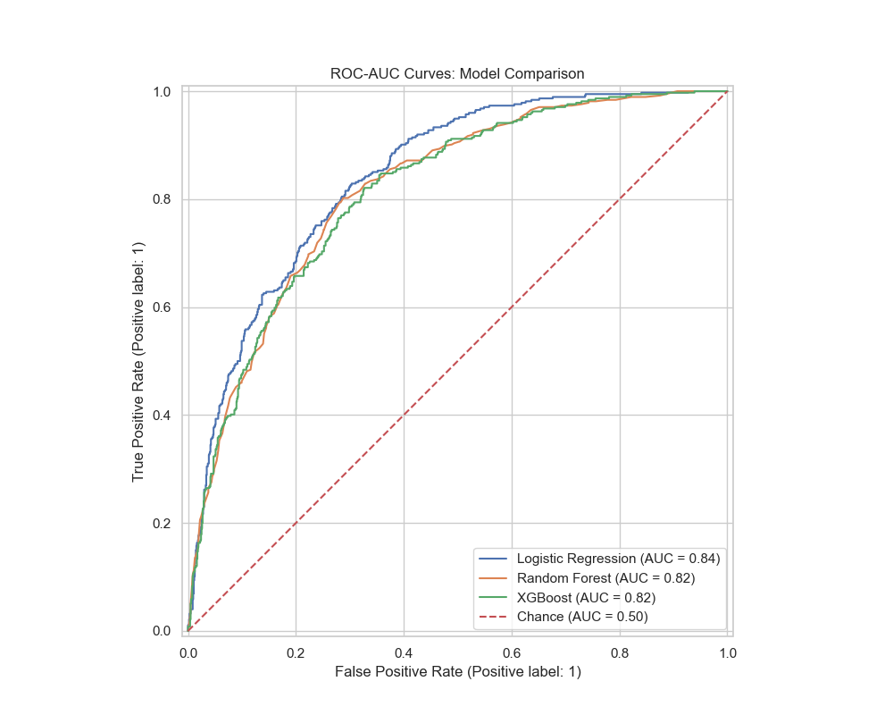

# Customer Churn Prediction — End-to-End Machine Learning System

<div align="center">

[](https://customer-churn-prediction-k9g5jvw7t7hptwl2pznz38.streamlit.app/)
[](https://python.org/)
[](https://xgboost.readthedocs.io/)
[](https://streamlit.io/)
[](https://scikit-learn.org/)
[](LICENSE)

**A production-grade machine learning pipeline that predicts telecom customer churn with ~85% ROC-AUC, deployed as an interactive Streamlit web application.**

</div>

---

## 📌 Project Overview

Customer churn — when subscribers stop using a service — is one of the costliest problems in the telecom industry, with acquisition costs **5–25× higher** than retention costs. This project builds a complete, end-to-end ML system that:

- **Identifies at-risk customers** before they churn using 19 behavioral and account features
- **Quantifies churn probability** (0–100%) for individual customers in real time
- **Scales to bulk analysis** via CSV upload for operations and CRM teams
- **Deploys instantly** to Streamlit Cloud — no infrastructure setup required

> **Business Impact:** A model with 85% AUC on a 7,000-customer base can help retain ~150 additional customers per month, translating to tens of thousands in monthly recurring revenue saved.

---

## 🧠 Technical Highlights

| Dimension | Detail |
|-----------|--------|
| **Algorithm** | XGBoost Gradient Boosting Classifier |
| **Preprocessing** | Scikit-learn Pipeline (StandardScaler + OneHotEncoder) |
| **Class Imbalance** | Random Under-Sampling (73% → 50/50 balance) |
| **Evaluation** | ROC-AUC, Precision, Recall, F1-Score, Confusion Matrix |
| **Serialization** | Joblib model persistence (`models/churn_model.pkl`) |
| **Deployment** | Streamlit Cloud (auto-trains on first boot) |
| **Dataset** | IBM Telco Customer Churn — 7,043 records, 21 features |

---

## 📊 Model Performance

| Metric | Score |
|--------|-------|
| **ROC-AUC** | **~0.85** |
| **Accuracy** | ~80% |
| **Churn Precision** | ~65% |
| **Churn Recall** | ~77% |
| **F1-Score (Churn)** | ~70% |

> XGBoost outperformed Logistic Regression and Random Forest on both AUC and stability across cross-validation folds.

**ROC-AUC Comparison (all models):**



---

## 🗂️ Repository Structure

```
Customer-Churn-Prediction/
│
├── app.py                                     ← Streamlit web application (main entry point)
├── train_model.py                             ← Standalone CLI model training script
├── customer_churn_project.ipynb               ← Full research notebook (EDA → modelling)
├── requirements.txt                           ← Pinned Python dependencies
├── README.md                                  ← This file
│
├── WA_Fn-UseC_-Telco-Customer-Churn.csv      ← Raw dataset (IBM Telco, 7,043 rows)
│
├── models/
│   └── churn_model.pkl                        ← Serialized sklearn Pipeline (auto-generated)
│
├── .streamlit/
│   └── config.toml                            ← Dark theme configuration
│
└── *.png                                      ← EDA visualizations from notebook
```

---

## ⚙️ ML Pipeline Architecture

```
Raw CSV (7,043 rows × 21 cols)
        │
        ▼
  Data Cleaning
  ├─ Drop customerID
  ├─ Coerce TotalCharges → numeric
  └─ Fill NaN → 0
        │
        ▼
  Train / Test Split  (80 / 20, stratified)
        │
        ▼
  Class Balancing  (Random Under-Sampling)
  └─ Majority class downsampled to match minority (26.5% → 50%)
        │
        ▼
  ColumnTransformer (sklearn Pipeline)
  ├─ StandardScaler       → tenure, MonthlyCharges, TotalCharges
  └─ OneHotEncoder        → 16 categorical features (gender, Contract, etc.)
        │
        ▼
  XGBClassifier
  ├─ n_estimators = 200
  ├─ max_depth    = 5
  ├─ learning_rate= 0.1
  ├─ subsample    = 0.8
  └─ colsample_bytree = 0.8
        │
        ▼
  joblib.dump → models/churn_model.pkl
```

---

## 🌐 Live Application Features

### 🔮 Real-Time Single Prediction
- 18-input sidebar form (demographics, services, account)
- Instant churn probability with a color-coded risk meter (🟢 Low / 🟡 Medium / 🔴 High)
- Personalized risk factor breakdown (contract type, tenure, charges)

### 📤 Batch Prediction via CSV Upload
- Upload any customer export CSV
- Bulk predict thousands of records in seconds
- Download results with `Churn_Probability`, `Predicted_Churn`, `Risk_Level` columns

### 📊 Exploratory Data Analysis Dashboard
- Churn distribution (donut chart)
- Contract type vs. churn (grouped bar)
- Monthly charges & tenure distributions by churn
- Internet service & payment method breakdowns
- Pearson correlation heatmap

### 🧠 Model Insights Panel
- Interactive ROC-AUC curve
- Confusion matrix heatmap
- Top-20 XGBoost feature importances (plasma colour scale)
- Full classification report table

### 🔧 Auto-Training on First Boot
- No manual setup needed on Streamlit Cloud
- App detects missing model file and trains automatically (~60 seconds)

---

## 🚀 Quickstart — Run Locally

```bash
# 1. Clone the repository
git clone https://github.com/srishanthreddy456789/Customer-Churn-Prediction.git
cd Customer-Churn-Prediction

# 2. Create and activate a virtual environment
python -m venv venv
venv\Scripts\activate          # Windows
# source venv/bin/activate     # macOS / Linux

# 3. Install dependencies
pip install -r requirements.txt

# 4. (Optional) Pre-train the model via CLI
python train_model.py

# 5. Launch the app
streamlit run app.py
# → Opens at http://localhost:8501
```

---

## 📦 Dependencies

```
streamlit>=1.32.0
pandas>=2.0.0
numpy>=1.24.0
scikit-learn>=1.3.0
xgboost>=2.0.0
matplotlib>=3.7.0
seaborn>=0.12.0
joblib>=1.3.0
```

---

## 📈 Key Findings from EDA

| Insight | Finding |
|---------|---------|
| **Contract type** | Month-to-month customers churn at **~42%** vs **~11%** for two-year contracts |
| **Tenure** | Customers with < 12 months tenure are **3× more likely** to churn |
| **Monthly charges** | Churned customers pay **$74/mo** on average vs **$61/mo** for retained |
| **Internet service** | Fiber optic users churn at **~41%** — highest of any service type |
| **Payment method** | Electronic check users have the **highest churn rate (~45%)** |
| **Add-on services** | Customers without OnlineSecurity / TechSupport churn significantly more |

---

## 🛠️ Tech Stack

| Category | Tools |
|----------|-------|
| **Language** | Python 3.11 |
| **ML Framework** | scikit-learn 1.3, XGBoost 2.0 |
| **Data Processing** | Pandas, NumPy |
| **Visualization** | Matplotlib, Seaborn |
| **Web Framework** | Streamlit 1.32 |
| **Model Persistence** | Joblib |
| **Version Control** | Git, GitHub |
| **Deployment** | Streamlit Community Cloud |

---

## 💡 Skills Demonstrated

`Machine Learning` · `Gradient Boosting` · `Feature Engineering` · `Class Imbalance Handling`
`Data Preprocessing` · `Model Evaluation` · `Pipeline Design` · `Hyperparameter Tuning`
`Exploratory Data Analysis` · `Data Visualization` · `Model Deployment` · `Streamlit`
`Python` · `Pandas` · `NumPy` · `scikit-learn` · `XGBoost` · `Joblib` · `Git`

---

## 👤 Author

**Srishanth Reddy**
- 🔗 GitHub: [@srishanthreddy456789](https://github.com/srishanthreddy456789)
- 🌐 Live App: [customer-churn-prediction.streamlit.app](https://customer-churn-prediction-k9g5jvw7t7hptwl2pznz38.streamlit.app/)

---

## 📄 License

This project is licensed under the **MIT License** — see [LICENSE](LICENSE) for details.

---

<div align="center">
<i>Built end-to-end: from raw CSV → EDA → feature engineering → model training → deployment.</i>
</div>
